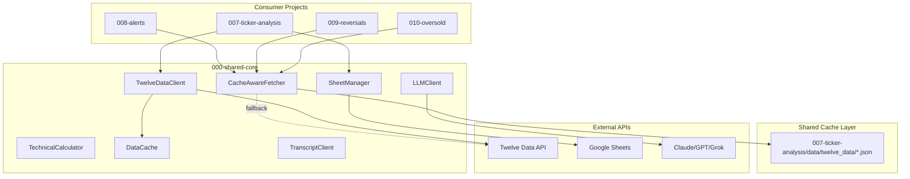

# Shared Core Library

Centralized library for common utilities used across the investing portfolio projects. Reduces code duplication and ensures consistent behavior.

## Modules

### Market Data

| Module | Description |
|--------|-------------|
| `TechnicalCalculator` | Full suite of technical indicators: SMA, EMA, RSI, MACD, Bollinger Bands, ATR, Stochastic, ADX, OBV, Williams %R, Rate of Change |
| `TwelveDataClient` | Twelve Data API client with caching, rate limiting, and automatic indicator calculation |
| `TranscriptClient` | Earnings call transcript fetcher using defeatbeta-api |
| `CacheAwareFetcher` | Unified cache-aware fetcher that uses shared cache from 008-ticker-analysis, with API fallback |

### Caching

| Module | Description |
|--------|-------------|
| `DataCache` | Date-based local JSON cache for API responses. Prevents redundant API calls and supports forced refresh |

### Integrations

| Module | Description |
|--------|-------------|
| `SheetManager` | Google Sheets integration: read tickers, write data with row replacement, conditional formatting |
| `LLMClient` | Unified interface for Claude, GPT, Grok, and Gemini with auto-retry logic |

## Installation

```bash
cd 000-shared-core
pip install -e .
```

Or for development:
```bash
pip install -e ".[dev]"
```

## Usage Examples

### Technical Indicators

```python
from shared_core import TechnicalCalculator
import pandas as pd

calc = TechnicalCalculator()

# Calculate RSI
rsi = calc.rsi(df['close'], period=14)

# Calculate MACD
macd_line, signal_line, histogram = calc.macd(df['close'])

# Calculate Bollinger Bands
upper, middle, lower = calc.bollinger_bands(df['close'])

# Classify trend
trend = calc.classify_trend(price, sma_20, sma_50, sma_200, macd_hist)
```

### Twelve Data Client

```python
from shared_core import TwelveDataClient, DataCache
from pathlib import Path

cache = DataCache(Path("data"))
client = TwelveDataClient(api_key="your_key", cache=cache)

# Fetch data with automatic caching and indicator calculation
result = client.fetch_and_calculate("NVDA")
print(result['price'], result['rsi'], result['macd_hist'])
```

### Transcript Client

```python
from shared_core import TranscriptClient, DataCache
from pathlib import Path

cache = DataCache(Path("data"))
client = TranscriptClient(cache=cache)

# Fetch latest earnings transcript
transcript = client.fetch_transcript("AAPL")
print(transcript['text'][:500])
```

### Cache-Aware Fetcher (Recommended for Consumer Projects)

```python
from shared_core.market_data.cached_fetcher import CacheAwareFetcher
from pathlib import Path

# Automatically uses shared cache from 008-ticker-analysis
fetcher = CacheAwareFetcher(
    api_key="your_key",
    cache_dir=Path("../007-ticker-analysis/data/twelve_data")
)

# Returns cached data if available today, otherwise calls API
data = fetcher.fetch("AAPL")  # {"values": [...], "meta": {"source": "cache"}}

# Batch fetch with intelligent cache usage
results = fetcher.fetch_batch(["AAPL", "NVDA", "TSLA"])

# Check if ticker is cached for today
is_cached = fetcher.is_cached("AAPL")  # True/False
```

### LLM Client

```python
from shared_core import LLMClient

client = LLMClient(
    provider="claude",
    api_key="sk-...",
    provider_settings={"model": "claude-sonnet-4-20250514", "max_tokens": 4096}
)

response = client.call_llm(
    prompt="Analyze NVDA stock technicals",
    system_message="You are a technical analysis expert."
)
```

### Sheet Manager

```python
from shared_core import SheetManager

manager = SheetManager("credentials.json", "My Portfolio Sheet")

# Read tickers from column A
tickers = manager.get_tickers("Watchlist", column="A", start_row=2)

# Write technical data
manager.write_tech_data_with_replacements("Technicals", data, existing_data)
```

## Architecture



## Projects Using This Library

| Project | Modules Used |
|---------|-------------|
| `003-investment-agent` | LLMClient |
| `004-stocks-tracker` | TwelveDataClient, DataCache |
| `006-ai-stock-analyzer` | TechnicalCalculator, TwelveDataClient |
| `007-ticker-analysis` | All modules (primary cache producer) |
| `008-alerts` | CacheAwareFetcher, TechnicalCalculator |
| `009-reversals` | CacheAwareFetcher, TechnicalCalculator |
| `010-oversold` | CacheAwareFetcher, TechnicalCalculator |

## Integration Pattern

Projects import from shared_core after installing it:

```python
from shared_core import TechnicalCalculator, TwelveDataClient, DataCache
```

Or import specific submodules:

```python
from shared_core.market_data.technical import TechnicalCalculator
from shared_core.cache.data_cache import DataCache
```

## Project Structure

```
000-shared-core/
├── src/
│   └── shared_core/
│       ├── __init__.py
│       ├── config.py
│       ├── cache/
│       │   ├── __init__.py
│       │   └── data_cache.py       # DataCache
│       ├── market_data/
│       │   ├── __init__.py
│       │   ├── technical.py        # TechnicalCalculator
│       │   ├── twelve_data.py      # TwelveDataClient
│       │   ├── transcript.py       # TranscriptClient
│       │   └── cached_fetcher.py   # CacheAwareFetcher
│       ├── integrations/
│       │   ├── __init__.py
│       │   └── sheets.py           # SheetManager
│       └── llm/
│           ├── __init__.py
│           └── client.py           # LLMClient
├── tests/
│   ├── test_technical.py
│   ├── test_twelve_data.py
│   ├── test_data_cache.py
│   ├── test_cached_fetcher.py  # Integration tests for cache
│   └── test_llm.py
├── pyproject.toml
├── requirements.txt
└── README.md
```

## Running Tests

```bash
cd 000-shared-core
pip install -e ".[dev]"
pytest tests/ -v
```

## Technical Indicators Reference

| Indicator | Method | Parameters |
|-----------|--------|------------|
| Simple Moving Average | `sma(data, period)` | period: int |
| Exponential Moving Average | `ema(data, period)` | period: int |
| Relative Strength Index | `rsi(close, period)` | period: int (default 14) |
| MACD | `macd(close, fast, slow, signal)` | fast=12, slow=26, signal=9 |
| Bollinger Bands | `bollinger_bands(close, period, num_std)` | period=20, num_std=2.0 |
| Average True Range | `atr(df, period)` | period: int (default 14) |
| Stochastic Oscillator | `stochastic(df, k_period, d_period)` | k_period=14, d_period=3 |
| ADX | `adx(df, period)` | period: int (default 14) |
| ADX Series | `adx_series(df, period)` | period: int (default 14) |
| On-Balance Volume | `obv(df)` | - |
| VWAP | `vwap(df, period)` | period: int (default 20) |
| Williams %R | `williams_r(df, period)` | period: int (default 14) |
| Rate of Change | `roc(close, period)` | period: int (default 14) |

## Trend Classification

| Method | Returns |
|--------|---------|
| `classify_trend()` | STRONG_UPTREND, UPTREND, SIDEWAYS, DOWNTREND, STRONG_DOWNTREND |
| `classify_obv_trend()` | UP, DOWN, SIDEWAYS |
| `detect_divergence()` | BULLISH, BEARISH, NONE |
| `classify_volatility()` | LOW, NORMAL, HIGH, EXTREME |

## License

Private/Internal Use
