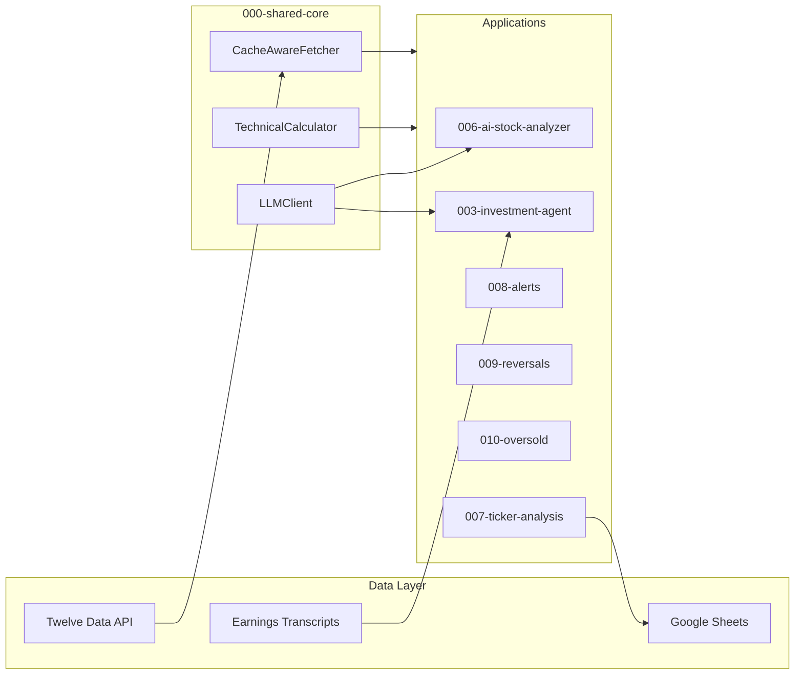

# Investment Portfolio Tools

A collection of production-ready investment analysis tools demonstrating **ML/AI systems**, **data engineering**, and **full-stack development** skills.

---

## Highlights

### Multi-Agent AI System for Stock Analysis
> **[006-ai-stock-analyzer](./006-ai-stock-analyzer/)** — Ensemble of 4 LLM models (Claude, GPT, Grok, Gemini) providing consensus-based technical analysis with 90% API cost reduction through intelligent caching.

### AI-Powered Investment Research Pipeline  
> **[003-investment-agent](./003-investment-agent/)** — 3-step LLM pipeline that processes earnings transcripts and podcasts to extract investment themes, identify companies, and filter for high-conviction picks.

### Real-Time Trading Alerts with Technical Triggers
> **[008-alerts](./008-alerts/)** — Automated daily scanner for 80+ tickers with configurable buy/sell triggers based on technical indicators, with email notifications via SendGrid.

---

## Architecture



---

## Projects by Category

### AI/ML Systems

| Project | Description | Tech Stack |
|---------|-------------|------------|
| **[006-ai-stock-analyzer](./006-ai-stock-analyzer/)** | Multi-agent consensus analysis using 4 LLMs | Claude, GPT-4, Grok, Gemini, Python |
| **[003-investment-agent](./003-investment-agent/)** | 3-step NLP pipeline for investment research | LLM APIs, prompt engineering, Python |

### Data Engineering & Automation

| Project | Description | Tech Stack |
|---------|-------------|------------|
| **[007-ticker-analysis](./007-ticker-analysis/)** | Primary data pipeline with caching and Google Sheets integration | Twelve Data API, gspread, pandas |
| **[000-shared-core](./000-shared-core/)** | Centralized library with 77 unit tests | pytest, tenacity, type hints |
| **[008-alerts](./008-alerts/)** | Automated trading alert system | SendGrid, GitHub Actions, cron |

### Quantitative Analysis

| Project | Description | Tech Stack |
|---------|-------------|------------|
| **[009-reversals](./009-reversals/)** | Mid-term reversal detection with divergence analysis | RSI, MACD, Stochastic, OBV |
| **[010-oversold](./010-oversold/)** | Multi-indicator oversold scoring system | Williams %R, SMA200 distance, weighted scoring |

### Full-Stack Applications

| Project | Description | Tech Stack |
|---------|-------------|------------|
| **[005-retirement-calculator](./005-retirement-calculator/)** | Inflation-adjusted retirement planning | React, Tailwind CSS, Chart.js |
| **[004-stocks-tracker](./004-stocks-tracker/)** | Sector analysis dashboard | Streamlit, pandas, CSV export |
| **[002-options-tracking](./002-options-tracking/)** | Options chain scanner with desktop GUI | wxPython, yfinance, threading |
| **[001-portfolio-tracker](./001-portfolio-tracker/)** | Native macOS/iOS portfolio manager | Swift, SwiftUI, Combine |

---

## Technical Skills Demonstrated

| Skill | Evidence |
|-------|----------|
| **LLM Integration** | Multi-provider client (Claude, GPT, Grok, Gemini) with retry logic |
| **API Design** | Shared library with lazy imports, rate limiting, caching |
| **Data Engineering** | Date-based caching, batch processing, format conversion |
| **Testing** | 120+ unit tests across projects, pytest fixtures, mocking |
| **Technical Analysis** | 15+ indicators: RSI, MACD, Bollinger Bands, ADX, OBV, etc. |
| **CI/CD** | GitHub Actions for daily automated scans |
| **Frontend** | React (retirement calc), Streamlit (tracker), SwiftUI (iOS) |

---

## Quick Start

```bash
# 1. Install shared library
cd 000-shared-core && pip install -e .

# 2. Populate cache (run daily)
cd ../007-ticker-analysis
python run_all.py

# 3. Run any consumer project instantly
cd ../008-alerts && python main.py --dry-run      # < 2 seconds
cd ../009-reversals && python reversals.py --dry-run  # < 2 seconds
cd ../010-oversold && python oversold.py --all       # < 5 seconds
```

---

## Test Coverage

```bash
# Run all tests
cd 000-shared-core && pytest tests/ -v  # 77 tests
cd ../008-alerts && pytest tests/ -v    # 13 tests
cd ../009-reversals && pytest tests/ -v # 8 tests
cd ../010-oversold && pytest tests/ -v  # 22 tests
# Total: 120+ tests passing
```

---

## Project Structure

```
000-099-investing/
├── 000-shared-core/       # Shared library (1,900 LOC)
├── 001-portfolio-tracker/ # Swift/iOS app
├── 002-options-tracking/  # Desktop options scanner
├── 003-investment-agent/  # AI research pipeline ⭐
├── 004-stocks-tracker/    # Streamlit dashboard
├── 005-retirement-calculator/  # React app
├── 006-ai-stock-analyzer/ # Multi-agent AI system ⭐⭐
├── 007-ticker-analysis/   # Data pipeline (cache producer)
├── 008-alerts/            # Trading alerts ⭐
├── 009-reversals/         # Reversal detection
└── 010-oversold/          # Oversold screener
```

---

## What Makes This Portfolio Stand Out

1. **Production-Ready Code** — Not toy projects; these run daily with real API calls and notifications
2. **DRY Architecture** — Shared library eliminates duplication, tested with 77 unit tests
3. **Multi-Modal AI** — Ensemble of 4 different LLMs for robust consensus analysis
4. **Full Stack** — Backend (Python), Frontend (React, Streamlit), Mobile (Swift)
5. **Quantitative** — Real technical indicators used in actual trading decisions

---

## License

Private/Internal Use

