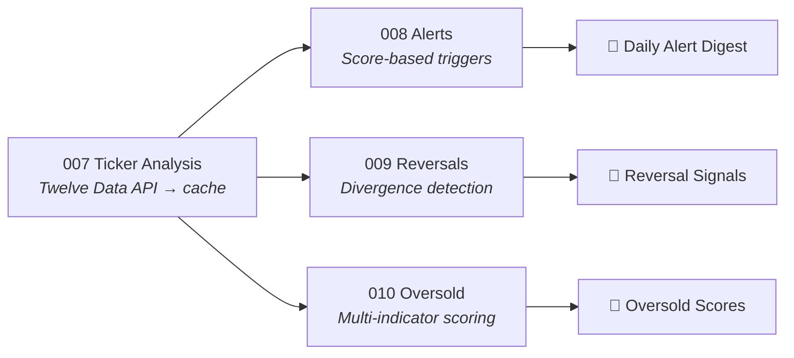

# Alex Bespalov

**Building automated financial analysis systems in Python and React.**


Everything here runs in production — daily cron jobs, live deployments, real alerts.

---

## Featured Projects

### Stock Technicals Pipeline

Daily automated analysis of 80+ tickers — technical indicators, reversal detection, and oversold scoring — delivered as email alerts every weekday at 4:30 PM ET.




Powered by a shared Python library (11k LOC) with RSI, MACD, Bollinger Bands, Williams %R, ADX, and more. GitHub Actions cache shares ticker data across parallel consumer jobs.

---

### LEAPS Options Tracker

Drawdown monitoring for long-dated call options with Black-Scholes delta valuation, dual drawdown tracking (ATH + 30-day rolling peak), and graduated Telegram alerts at -20% / -40% / -60%.

[](https://optionstracker-pi.vercel.app)


Python cron fetches daily options data → computes mid-price and drawdowns → persists to Supabase → Astro dashboard renders on Vercel.

---

### Mining Capitulation Alerts

Telegram bots monitoring 2 ASIC miner marketplaces (SimpleMining, Blockware) for capitulation deals — alerts when new-gen hardware drops 60–75% off ATH. Filters by efficiency (≤17.5 J/TH), computes revenue and ROI from live hashprice.


Runs every 10 minutes + daily digest. Multi-benchmark discount logic (last trade, ATH, 90-day average).

---

### Product Hunt Weekly Digest

Sunday scraper → AI enrichment via xAI Grok → Supabase storage → email digest with ranked products, AI-generated insights, and category breakdowns.


Full pipeline: scrape → AI enrich → upsert → email. Runs automatically every Sunday via GitHub Actions.

---

### Bitcoin Mining Calculators

Suite of 5 production React financial calculators — profitability matrices across electricity rates, BTC-backed loan risk, hardware price tracking, multi-asset portfolio modeling with Black-Scholes options valuation.

[](https://bitcoin-mining-calculator.vercel.app)
[](https://btc-loan-calculator.vercel.app)
[](https://miner-price-tracker.vercel.app)
[](https://portfolio-analyzer.vercel.app)
[](https://mine-and-hodl.vercel.app)


All 5 apps deployed and running on Vercel. Shared zero-dependency JS library for mining calculations, constants, and formatters.

---

## Also Built

- **AA Points Tools** — American Airlines points optimization (SimplyMiles scraper, streak optimizer, hotel search)
- **Shared Core Libraries** — Python (11k LOC) and JavaScript packages powering all projects above

---

## Tech Stack


---

<details>
<summary>Repository Structure</summary>

```
000-099-investing/
├── 000-shared-core/         # Python library — technical indicators, caching, LLM clients
├── 007-ticker-analysis/     # Cache producer → Twelve Data API + Google Sheets
├── 008-alerts/              # Daily trading alerts → email
├── 009-reversals/           # Mid-term reversal detection
├── 010-oversold/            # Multi-indicator oversold scoring
└── 012-options-tracker/     # LEAPS drawdown monitor + Astro dashboard

100-199-bitcoin-mining/
├── 100-shared-core/         # Shared JS library — calculations, constants, formatters
├── 101-mining-profitability-calculator/
├── 102-btc-loan-calculator/
├── 103-miner-price-tracker/
├── 104-portfolio-analyzer/
├── 105-landing-page/
├── 106-miner-price-scraper/
└── 107-capitulation-alerts/ # SimpleMining + Blockware marketplace bots

200-other/
├── 202-product-hunt-ranking/  # Weekly AI-enriched digest
└── 204-aa-tools/              # AA points optimization suite
```

</details>

---

Austin, TX · [GitHub](https://github.com/alexbesp18) · Open to Data Engineering, AI Engineering, and Quantitative Developer roles
